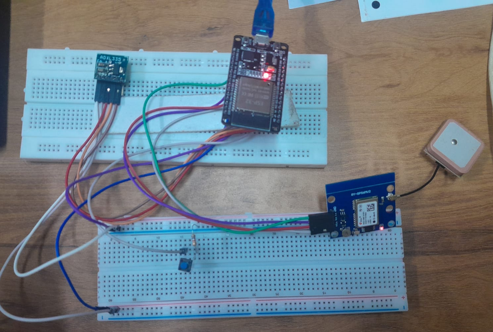
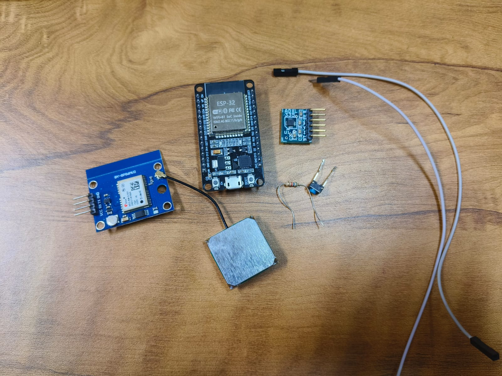

  

# SECUREHER 🎯

## Basic Details

### Team Name: HerTz

### Team Members
- Member 1: Iza K Jamaludheen - SCMS School of Engineering & Technology
- Member 2: Ameena Jennath KS - SCMS School of Engineering & Technology

### Project Description
The project aims to design and develop a smart women safety wearable device that provides immediate assistance during emergency situations. The system is designed to be compact, portable, and easy to use, ensuring quick activation even under stress.
The device is built using an ESP32 microcontroller, an ADXL335 accelerometer, a GPS module, and a push button. The accelerometer continuously monitors the user’s motion, while the push button acts as an arming mechanism to prevent false triggers. When the user presses the button, the system enables motion detection for a predefined time window. If abnormal or panic motion is detected within this interval, the system identifies it as an emergency.

### The Problem statement
Ensuring the safety of women in public and isolated environments remains a critical social challenge. In emergency situations, victims may not be able to access their mobile phones to make calls or send messages due to panic, physical restraint, or time constraints.
Therefore, there is a need for a compact, wearable, and easy-to-activate safety device that can automatically detect distress situations and send emergency alerts with location information. The system should minimize false triggering, operate in real time, and provide reliable communication to emergency contacts

### The Solution

The problem of delayed or inaccessible emergency communication is solved by designing a gesture-based, IoT-enabled women safety device that operates independently of mobile phone interaction during critical situations.
The solution uses an ESP32 microcontroller as the central processing unit. A push button is used to intentionally arm the system, which prevents accidental activation. Once armed, an ADXL335 accelerometer continuously monitors the user’s motion to detect abnormal or panic movements.
When the detected acceleration exceeds a predefined threshold within a specific time window, the system identifies the situation as an emergency. The ESP32 then retrieves the user’s real-time location using a GPS module. This information, along with an emergency alert message, is transmitted through a Telegram bot using Wi-Fi connectivity.

---

## Technical Details

### Technologies/Components Used

**For Hardware:**

- Main components:
  ESP32 Development Board – Main microcontroller
  ADXL335 Accelerometer – Motion / panic gesture detection
  GPS Module (NEO-6M) – Real-time location tracking
  Push Button – User confirmation to avoid false triggering
  
- Tools required:
  Arduino IDE
  
---

## Features

List the key features of your project:
- Feature 1: Gesture based emergency detection: detects a panic motion using a 3-axis accelerometer
- Feature 2: Instant Alert via telegram: Sends emergency notifications with location details to predefined contacts through a Telegram bot using Wi-Fi connectivity.
- Feature 3: Real-Time Location Tracking: Fetches live geographical coordinates using a GPS module and shares the user’s location during emergencies
- Feature 4: False Trigger Prevention: Uses a push-button arming mechanism and a predefined time window to ensure alerts are triggered only with user intent.

---

## Implementation

### For Hardware:

#### Components Required
Microcontroller: ESP32 Development Board [ESP32devkit] with wifi module
Accelerometer: ADXL335 - 3 axus accelerometer with analog output
GPS Module: NEO-6M to provide real time latitude and longitude.
Push button: Momentary push button to prevent false triggers.
Resistor: 5.7K ohm, the push button requires a resistor to avoid floating input values.
Jumper Wires

#### Circuit Setup
The circuit is constructed by interfacing all input and output components with the ESP32 microcontroller, which acts as the central control unit.
The ADXL335 accelerometer is powered using the 3.3 V supply from the ESP32, and its X, Y, and Z axis output pins are connected to the ESP32’s pins to continuously monitor motion. A push button is connected to a digital pin configured with an internal pull-up resistor, allowing the user to arm the system intentionally.
The GPS module is powered using the 5 V supply and communicates with the ESP32 through UART serial communication, where the GPS transmit pin is connected to the ESP32 receive pin and vice versa. This enables continuous reception of location data.
The ESP32 is powered via USB or battery, and once the connections are established, the circuit is ready for programming and testing.

---

## Project Documentation

### For Hardware:

#### Schematic & Circuit

*Add caption explaining connections*

*Add caption explaining the schematic*

#### Build Photos

*List out all components shown*

*Explain the build steps*

  

*Explain the final build*

---

## Additional Documentation

### For Hardware Projects:

#### Bill of Materials (BOM)

| Component | Quantity | Specifications | Price | Link/Source |
|-----------|----------|----------------|-------|-------------|
| ESP32 Dev Board | 1 | Dual-core MCU, Wi-Fi 2.4 GHz, 3.3 V logic | ₹600 | Local electronics store |
| Resistor| 1 | 5.6k| ₹1 each | Local electronics store|
| Breadboard | 1 | 830 points | ₹100 | Local electronics store |
| Jumper Wires | 10 | Female-to-Female | ₹25 | Local electronics store |
| GPS Module (NEO-6M) | 1 |UART, 9600 bps, external antenna | ₹500 | Local electronics store |
| Push Button| 1 | momentary tactile switch | ₹10 | Local electronics store|
| ADXL335 Accelerometer | 1 | 3-axis, analog output, ±3 g | ₹250| FAB Lab|

**Total Estimated Cost:** ₹1486

#### Assembly Instructions

**Step 1: Prepare Components**
1. Gather all components listed in the Bill of Materials (BOM).
2. Verify specifications of each component (operating voltage, pin configuration).
3. Ensure the ESP32, GPS module, and accelerometer are undamaged.
4. Prepare a clean workspace with a breadboard and jumper wires.

  

*Caption: All components laid out*

**Step 2: Build the Power Supply**
1. Place the ESP32 development board near the breadboard
2. Connect the ESP32 3.3 V pin to the breadboard positive rail (for ADXL335).
3. Connect the ESP32 5 V pin to the breadboard positive rail (for GPS module).
4. Connect the ESP32 GND pin to the breadboard ground rail.
5. Ensure all modules share a common ground.

**Step 3: Add Components**
1. Place the push button on the breadboard.
2. Place the ADXL335 module on the breadboard.
3. Place the GPS module on the breadboard.

**Final Assembly:**
After completing all connections, upload the program to the ESP32. Once powered, the system initializes, connects to Wi-Fi, and waits for user input. The completed setup is now ready for testing and demonstration.

  

*Caption: Completed project ready for testing*

---

## Project Demo

### Video
https://drive.google.com/file/d/1IC1RlFa6Btm0kpzLCH0GZjIPoMMjFAeP/view?usp=drivesdk

This video demonstrates the working of a gesture-based women safety device developed using an ESP32 microcontroller. The system integrates an ADXL335 accelerometer, a GPS module, a push button, and a Telegram-based alert mechanism to provide real-time emergency notifications. At the beginning of the demo, the system is powered on and initializes all connected modules. The ESP32 establishes a Wi-Fi connection and waits in standby mode. The user then presses the push button, which arms the system and enables motion detection for a predefined time window. This step ensures intentional activation and prevents false triggering. When abnormal or panic motion is detected using the accelerometer, the system identifies it as an emergency. The ESP32 immediately retrieves the user’s location from the GPS module and sends an emergency alert message via a Telegram bot using Wi-Fi connectivity. The alert includes the current location link, which can be opened directly in Google Maps. The serial monitor output is shown during the demonstration to verify system status, motion detection, GPS data, and successful message transmission. This video highlights the reliability, real-time response, and practical implementation of the proposed women safety system. Since the demonstration is conducted indoors, the GPS module may not acquire a satellite fix; however, the alert mechanism and system logic are successfully demonstrated.

## AI Tools Used 

**Tool Used:** ChatGPT

**Purpose:**
- Concept clarification and system design guidance
- Debugging assistance for ESP32 code and sensor integration
- Understanding communication protocols (UART, Wi-Fi, HTTP)
- Improving documentation clarity (problem statement, solution, features, etc.)

**Key Prompts Used:**
-“How to interface ADXL335 accelerometer with ESP32?”
-“Debug ESP32 code for GPS and Wi-Fi communication”
-“How to send emergency alerts using Telegram bot from ESP32?”

**Percentage of AI-generated code:** 30-40%

**Human Contributions:**
-Overall architecture design and system planning
-Selection of components and hardware connections
-Circuit assembly and physical wiring
-Custom logic implementation (arming mechanism, false trigger prevention, timing logic)
-Integration of sensors, GPS, and Telegram communication
-Testing, debugging, and validation of the complete system

---

## Team Contributions

- Iza K Jamludheen: System design and overall architecture planning, ESP32 programming, integration of ADXL335 accelerometer and GPS module, testing and debugging of the complete hardware–software setup, and documentation preparation.
- Ameena Jennath KS: Circuit assembly and hardware interfacing, push button integration, assistance in sensor calibration and signal testing, support in debugging and validation of system functionality, and contribution to project documentation and presentation.

---

## License

This project is licensed under the [LICENSE_NAME] License - see the [LICENSE](LICENSE) file for details.

**Common License Options:**
- MIT License (Permissive, widely used)
- Apache 2.0 (Permissive with patent grant)
- GPL v3 (Copyleft, requires derivative works to be open source)

---

Made with ❤️ at TinkerHub
